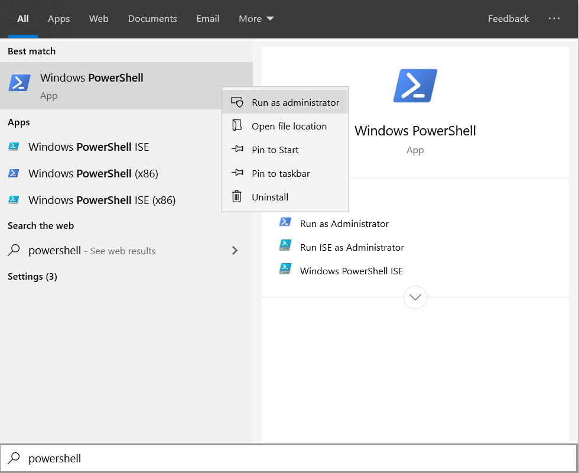
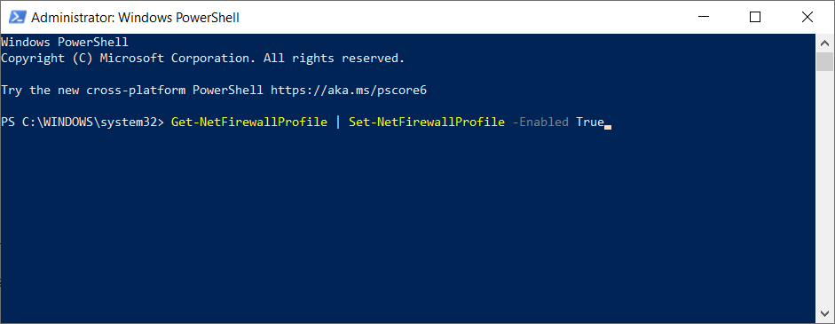

# Troubleshooting Guide - io.netty Connection Timed Out (Windows OS)
##### Try using the Technic Launcher
#
- [Technic Launcher](https://www.technicpack.net/download/)
- [Technic Installation Guide](http://tutorial.mc-complex.com/)

# 
##### Step 1) Try Restarting Router
#
1) Power off router 
2) Wait 5 minutes
3) Power it back on

#
##### Run Powershell as Administrator
#
1) Close out all instances of Minecraft and make sure it is not running. 
2) Click Start -> Type "Powershell" -> Right-Click "Windows Powershell" -> Click "Run as Administrator"
<details>
  <summary>Ref.1 - Click Me!</summary>
    <p align="center">
    
    
    </p>
</details>

#
##### Enter the Following Commands
#

**Warning:** Do not run "Get-NetAdapter | where..." Command if you run Virtual Machines or have a SOHO Network dependant on utilizing an organization's default DNS Server.
1) Copy the following commands and enter the commands one at a time below;
```
Get-NetFirewallProfile | Set-NetFirewallProfile -Enabled True
Get-NetFirewallRule | where {$_.DisplayName -like "Java(TM) Platform SE Binary"} | Set-NetFirewallRule -Action Allow -Profile Public, Private
netsh winsock reset catalog
netsh int ip reset reset.log
Get-NetAdapter | where {$_.status -like "up"} | Set-DnsClientServerAddress -ServerAddresses 1.1.1.1, 8.8.8.8
ipconfig /release
```
2) Wait 1 minute
3) Copy the following commands and enter the commands one at a time below;
```
ipconfig /renew
ipconfig /flushdns
```
4) Restart Computer
<details>
  <summary>Ref.2 - Click Me!</summary>
    <p align="center">
    
    
    </p>
</details>

**Internet Connection Broke?** - If your internet connection stopped working after this, run these 2 commands again;
```
ipconfig /release
ipconfig /renew
```

#
##### Attempt to connect to the Server
#
1) Try to connect to the Pixelmon Server again
2) If you get the same issue again, it's most likely an ISP issue and you will have to wait until your internet service provider fixes it over time.

#
##### Send Logs
#
1) If everything fails, copy the following commands and enter the commands one at a time below;
```
ping pixel.mc-complex.com | Out-File $home\desktop\logs.txt
Tracert pixel.mc-complex.com | Out-File -Append $home\desktop\logs.txt
Get-NetFirewallProfile | select Name,Enabled,AllowInboundRules, AllowLocalFirewallRules, AllowUserApps, AllowUserPorts  | Out-File -Append $home\desktop\logs.txt
Get-NetFirewallRule | where {$_.DisplayName -like "*Java*"}  | select DisplayName, Enabled, Profile  | Out-File -Append $home\desktop\logs.txt
Get-DnsClientServerAddress  | Out-File -Append $home\desktop\logs.txt
```
2) Copy the new "logs.txt" file that was created on your desktop and send it to the Discord Ticket.

#
##### Alternatives
#
1) Try testing the issue with someone else's internet
2) An alternative fix is to use a VPN, as it will normally fix this issue. Try using a Free VPN with Proton if you don't have one.
- [Sign-Up Link](https://account.protonvpn.com/signup)
- [Download Link](https://protonvpn.com/download/)

# Credits - CG Pixelmon
```
Buumee (Troubleshooting Guide)
Hazz (Technic Launcher Guide)
```
